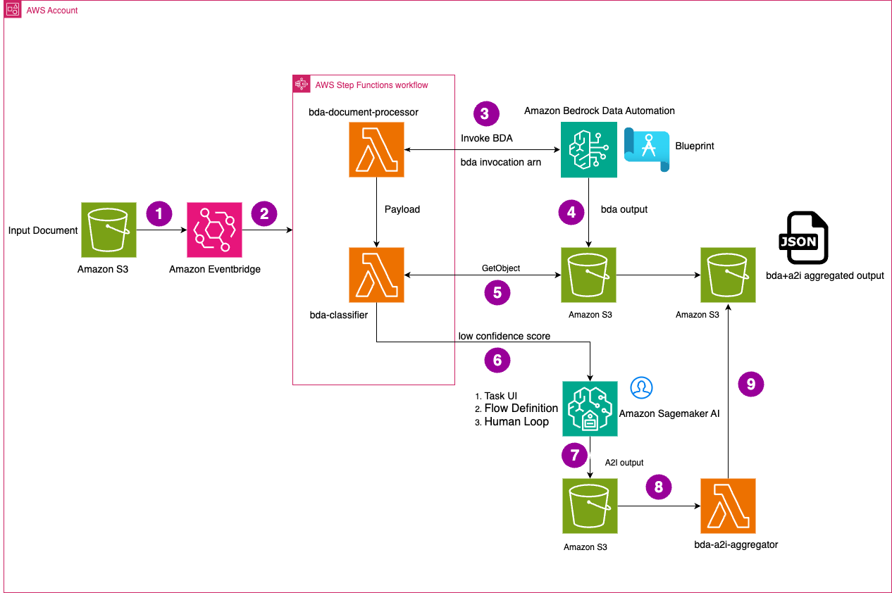

# Process multi-page documents with human review using Amazon Bedrock Data Automation and Amazon Augmented AI

This solution demonstrates how to process multi-page documents using Amazon Bedrock Data Automation (BDA) with human review capabilities through Amazon Augmented AI (A2I). The solution automatically extracts structured data from various document types and routes low-confidence results to human reviewers for validation.



## Overview

The solution processes PDF documents through an automated pipeline that:

1. **Document Processing**: Uses Amazon Bedrock Data Automation to extract structured data from uploaded PDF documents
2. **Classification & Confidence Scoring**: Analyzes extraction confidence and determines if human review is needed
3. **Human Review**: Routes low-confidence extractions to human reviewers via Amazon A2I
4. **Result Aggregation**: Combines automated and human-reviewed results into final structured output


## Architecture Components

### Core Services
- **Amazon Bedrock Data Automation**: Automated document processing and data extraction
- **Amazon Augmented AI (A2I)**: Human review workflow for low-confidence results
- **AWS Step Functions**: Orchestrates the document processing pipeline
- **Amazon S3**: Stores input documents and processing results
- **AWS Lambda**: Handles document processing, classification, and result aggregation

### Processing Flow
1. **Document Ingestion** - Documents are uploaded to an Amazon S3 input bucket which serves as entry point for all the documents processed through BDA.
2. **Workflow Trigger** - An Amazon EventBridge rule automatically detects new objects in the S3 bucket and triggers the AWS Step Functions workflow that orchestrates the entire document processing pipeline.
3. **Bedrock Data Automation Processing** - Within the Step Functions workflow, the "bda-document-processor" Lambda function is executed, which invokes Amazon Bedrock Data Automation (BDA) with the appropriate blueprint. BDA uses these pre-configured instructions to extract and process information from the document.
4. **Extraction Output Storage** - BDA analyzes the document, extracts key fields with associated confidence scores, and stores the processed output in another S3 bucket. This output contains all the extracted information and corresponding confidence levels.
5. **Classification and Confidence Evaluation** - The Step Functions workflow then executes the "bda-classifier" Lambda function, which retrieves the BDA output from S3. This Lambda evaluates the confidence scores against predefined thresholds for all extracted fields. This lambda also copies the bda output and stores it in aggregated_result folder in the same S3 bucket. 
6. **Human Review Process** - For fields with confidence scores below the threshold, the workflow routes the document to SageMaker A2I for human review. Using the custom UI, humans review the tasks and validate all fields from all pages. Reviewers can correct any fields that were incorrectly extracted by the automated process.
7. **Human Review Output** - The validated and corrected form data from human review is stored in an S3 bucket
8. **bda-a2i aggregator** - Once A2I output is written to S3, it executes the “bda-a2i-aggregator” lambda which updates the payload of bda output with the new value which was reviewed by human. This aggregated output is stored in S3. 

## Prerequisites

- AWS CLI configured with appropriate permissions
- Node.js 18.x or later
- Docker (for Lambda container builds)
- AWS CDK v2 installed globally: `npm install -g aws-cdk`

## Deployment

To deploy this solution, you need AWS CDK, Node.js, and Docker installed on your deployment machine. A build script performs the packaging and deployment of the solution.

To deploy the solution

1. Clone the solution repository to your deployment machine.
2. Navigate to the project directory and run the build script: 

`./build.sh`

The deployment creates the following resources in your AWS account:

* Two new S3 buckets - one for the initial upload of documents and one for the output of documents
* A Bedrock Data Automation Project along with 5 Blueprints used to process the test document
* A Cognito User Pool for the Private Workforce that Ground Truth provides to SageMaker Augmented AI for data that is below a confidence score.
* Two Lambdas and a Step Function used to process the test documents
* Two ECR Container Images used for the Lambdas to process the test documents


## Usage

### 1. Upload Documents
Upload PDF documents to the input S3 bucket (output from CDK deployment):
```bash
aws s3 cp your-document.pdf s3://<input-bucket-name>/
```

### 2. Monitor Processing
- Check Step Function execution in AWS Console
- View processing logs in CloudWatch
- Monitor A2I human tasks in SageMaker Ground Truth

### 3. Retrieve Results
Processed results are stored in the output S3 bucket:
- **Automated results**: `bda-output/<execution-id>/`
- **Human review results**: `a2i-output/bda-review-flow-definition/`
- **Aggregated results**: `aggregated_result/<execution-id>/`

## Human Review Workflow

When document confidence falls below the threshold:

1. **Task Creation**: A2I creates human review tasks with document images
2. **Review Interface**: Human reviewers validate and correct extracted data
3. **Result Processing**: Aggregator Lambda combines human feedback with original results
4. **Final Output**: Updated structured data stored in output bucket

## Development

### Project Structure
```
├── lib/                          # CDK stack definition
├── src/
│   ├── bda-document-processor/   # BDA invocation Lambda
│   ├── bda-document-classifier/  # Confidence scoring and A2I task creation
│   ├── bda-a2i-aggregator/      # Human review result processing
│   └── bda-blueprints/          # Document schema definitions
├── test/                        # Unit tests
└── assets/                      # Sample documents
```

### Useful Commands

- `npm run build`: Compile TypeScript to JavaScript
- `npm run watch`: Watch for changes and compile
- `npm run test`: Run Jest unit tests
- `npx cdk deploy`: Deploy stack to AWS
- `npx cdk diff`: Compare deployed stack with current state
- `npx cdk synth`: Generate CloudFormation template

### Adding New Document Types

1. Create a new blueprint JSON file in `src/bda-blueprints/`
2. Update the CDK stack to include the new blueprint
3. Redeploy the stack

### Customizing Confidence Thresholds

Adjust the `ConfidenceScore` parameter during deployment or update the Lambda environment variable.

## Monitoring and Troubleshooting

### CloudWatch Logs
- `/aws/lambda/bda-multi-page-a2i/bda-processor-lambda-function`
- `/aws/lambda/bda-multi-page-a2i/bda-classifier-lambda-function`
- `/aws/lambda/bda-multi-page-a2i/bda-a2i-aggregator-lambda-function`

### Common Issues
- **BDA Processing Timeout**: Increase Lambda timeout or implement pagination for large documents
- **A2I Task Creation Failures**: Verify workforce configuration and IAM permissions
- **Low Confidence Scores**: Review document quality and consider blueprint adjustments

## Cost Optimization

- Configure S3 lifecycle policies for processed documents
- Set appropriate Lambda memory and timeout settings
- Monitor BDA usage and optimize blueprint complexity
- Use S3 Intelligent Tiering for long-term storage

## Clean up
To terminate all resources created in this solution, run the flowing command from the project root directory

`cdk destroy`

## Security

This solution implements security best practices:
- S3 buckets with encryption and blocked public access
- IAM roles with least-privilege permissions
- VPC endpoints for private communication (optional)
- SSL/TLS encryption for all data in transit

See [CONTRIBUTING](CONTRIBUTING.md#security-issue-notifications) for more information.

## Contributing

We welcome contributions! Please see [CONTRIBUTING](CONTRIBUTING.md) for details on how to submit pull requests, report issues, and contribute to the project.

## License

This library is licensed under the MIT-0 License. See the [LICENSE](LICENSE) file.
